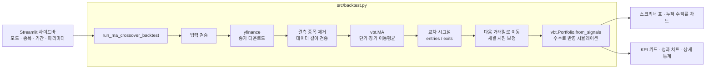

# 📈 QUANTMIND — 이동평균 교차 전략 백테스팅 & 스크리너

주식과 암호화폐의 과거 가격으로 **이동평균선 교차(골든크로스·데드크로스) 전략**을 검증하고, 여러 종목의 성과를 한 화면에서 비교하는 퀀트 투자 대시보드입니다.

     

<!--
## 📸 화면

| 다중 종목 스크리너 | 단일 종목 상세 분석 |
| --- | --- |
|  |  |
-->

<br/>

## 1. 프로젝트 개요

| 항목 | 내용 |
| --- | --- |
| 주제 | 이동평균선 교차 전략 백테스팅 및 다중 종목 스크리닝 |
| 목적 | 감이 아닌 과거 데이터로 매매 전략의 수익성과 위험을 검증하고, 종목별 성과를 비교해 순위를 매기는 것 |
| 동기 | 투자 전략을 데이터로 검증하는 퀀트 투자의 과정을 데이터 수집 → 전략 계산 → 시뮬레이션 → 시각화까지 직접 구현해 보기 위해 시작 |
| 대상 자산 | 미국 주식, 암호화폐, 국내 주식(KOSPI `.KS` / KOSDAQ `.KQ`) |

<br/>

## 2. 주요 기능

### 🔍 다중 종목 스크리너
- 미리 정의된 종목 그룹을 선택하거나, 티커를 쉼표로 구분해 직접 입력합니다.

  | 그룹 | 종목 |
  | --- | --- |
  | 🇺🇸 미국 빅테크 | AAPL, MSFT, GOOGL, AMZN, NVDA, TSLA, META |
  | 🪙 주요 암호화폐 | BTC-USD, ETH-USD, SOL-USD, DOGE-USD |
  | 🇰🇷 KOSPI IT/반도체 | 삼성전자, SK하이닉스, NAVER, 카카오 |

- 종목별 **최근 시그널, 총 수익률, 최대 낙폭(MDD), 샤프 지수, 승률, 거래 횟수**를 표로 보여줍니다.
- 매수 시그널과 수익은 초록색, 매도 시그널과 손실은 빨간색으로 강조합니다.
- 자산별 **누적 수익률 비교 차트**를 제공합니다.

### 📊 단일 종목 상세 분석
- 총 수익률, MDD, 샤프 지수, 승률을 **KPI 카드**로 보여줍니다. 값에 따라 색상이 달라집니다.
- 누적 수익률, 낙폭(Drawdown), 매매 시점을 한 번에 보여주는 차트를 제공합니다.
- vectorbt가 계산한 전체 성과 지표를 표로 펼쳐 볼 수 있습니다.

### ⚙️ 공통 파라미터
- 분석 기간 (시작일 · 종료일, 종료일 기본값은 오늘)
- 단기 이동평균 기간 (2~100일), 장기 이동평균 기간 (10~300일)
- 초기 자본, 거래 수수료(%)

<br/>

## 3. 전략 로직

```
단기 이동평균(기본 10일)이 장기 이동평균(기본 50일)을
  아래에서 위로 돌파 (골든크로스)  → 매수
  위에서 아래로 돌파 (데드크로스)  → 매도 후 현금 보유
```

- 롱 온리(Long-only) 전략이며, 종목마다 초기 자본을 따로 배정해 독립적으로 운용합니다 (`cash_sharing=False`).
- 시그널은 당일 종가로 계산하고, 체결은 **다음 거래일 종가**로 처리합니다. 장 마감 후에야 시그널을 알 수 있는 현실을 반영한 것입니다.
- 모든 거래에 수수료(기본 0.1%)를 반영합니다.
- **최근 시그널 판정** (`get_latest_signal_info`)은 마지막 매수 시그널과 마지막 매도 시그널의 날짜를 비교해 현재 상태를 알려줍니다.

  | 상태 | 조건 |
  | --- | --- |
  | 매수 보유 | 마지막 매수가 마지막 매도보다 최근 |
  | 현금 관망 | 마지막 매도가 마지막 매수보다 최근 |
  | 매수 진입 / 매도 청산 | 한쪽 시그널만 존재 |
  | 관망 | 시그널 없음 |

<br/>

## 4. 아키텍처



### 설계 포인트

- **UI와 엔진 분리:** 계산 로직은 `src/backtest.py`에, 화면은 `app.py`에 두어 엔진을 대시보드 없이 단독으로 실행·테스트할 수 있게 했습니다.
- **계산 전 입력 검증:** 티커, 이동평균 기간(양수, 단기 < 장기), 자본, 수수료 범위, 날짜 형식과 순서를 먼저 검사합니다.
- **부분 실패 허용:** 여러 종목 중 일부 데이터가 비어 있으면 그 종목만 제외하고 나머지로 분석을 이어갑니다.
- **데이터 부족 방지:** 데이터 개수가 장기 이동평균 기간보다 적으면 명확한 오류 메시지로 중단합니다.
- **단계별 예외 처리와 로깅:** 다운로드, 전략 계산, 시뮬레이션 단계마다 오류를 따로 잡아 원인을 알 수 있게 했습니다.
- **벡터 연산:** vectorbt로 여러 종목을 반복문 없이 한 번에 계산하고, 다단 컬럼은 티커 이름 한 단계로 정리해 화면 코드를 단순하게 유지했습니다.

<br/>

## 5. 프로젝트 구조

```
QuantInvesting/
├── app.py            # Streamlit 대시보드 (UI, 두 가지 분석 모드, 차트)
├── requirements.txt  # 의존성 목록
└── src/
    ├── backtest.py   # 백테스팅 엔진 (데이터 수집, 전략 계산, 시뮬레이션)
    └── ai_task.md    # 구현 가이드 문서
```

<br/>

## 6. 실행 방법

```bash
# 의존성 설치 (vectorbt는 plotly 6과 호환되지 않아 plotly 5.x로 고정)
pip install -r requirements.txt

# 대시보드 실행
streamlit run app.py

# 엔진만 단독 실행 (AAPL, MSFT, TSLA 성과 요약 출력)
python -m src.backtest
```

<br/>

## 7. 트러블슈팅

### ① 최신 yfinance에서 단일 종목 분석 실패

- **문제:** 단일 종목 모드에서 다음 오류가 나며 분석이 중단됐습니다.
  ```
  RuntimeError: 데이터 수집에 실패했습니다: 'DataFrame' object has no attribute 'to_frame'
  ```
- **원인:** yfinance 0.2.48부터는 종목이 하나여도 `(Price, Ticker)` 두 단계 컬럼으로 데이터를 돌려줍니다. 그래서 `df['Close']`가 Series가 아닌 DataFrame이 되어 `.to_frame()`을 쓸 수 없었습니다.
- **해결:** `Close`가 DataFrame이면 첫 번째 열을 티커 이름으로 바꿔 쓰고, Series면 기존처럼 변환하도록 두 형식을 모두 처리했습니다. 설치 버전도 `requirements.txt`에 명시했습니다.
  ```python
  close = df['Close']
  if isinstance(close, pd.DataFrame):
      close_df = close.iloc[:, [0]].copy()
      close_df.columns = [tickers[0]]
  else:
      close_df = close.to_frame(name=tickers[0])
  ```
- **검증:** 가짜 가격 데이터로 예전 형식과 새 형식을 각각 넣어 단일·다중 종목 분석이 모두 동작하는 것을 확인했습니다.

### ② 시그널 당일 종가 체결로 인한 look-ahead bias

- **문제:** 당일 종가로 이동평균 교차를 계산한 뒤, 같은 날 종가에 매수·매도한 것으로 처리하고 있었습니다.
- **원인:** 교차 여부는 장이 끝나 종가가 확정된 뒤에야 알 수 있습니다. 거래 시점에는 아직 알 수 없는 정보를 쓴 셈이라, 백테스트 결과를 실제로는 재현할 수 없었습니다.
- **해결:** 체결용 시그널을 하루 늦춰 **다음 거래일 종가에 체결**하도록 바꿨습니다. 화면의 "최근 시그널"은 시그널이 발생한 날짜를 그대로 보여줍니다.
  ```python
  exec_entries = entries.shift(1, fill_value=False).astype(bool)
  exec_exits = exits.shift(1, fill_value=False).astype(bool)
  ```
- **검증:** 모든 매수·매도 주문이 같은 방향 시그널의 다음 거래일에, 그날 종가로 체결되는 것을 주문 기록으로 확인했습니다.

### ③ 날짜 형식 오류 안내가 표시되지 않음

- **문제:** 날짜를 `2023/01/01`처럼 잘못 입력하면, 준비한 한국어 안내 대신 영문 오류(`time data '...' does not match format`)가 그대로 나왔습니다.
- **원인:** 오류 문구에 "strptime"이라는 단어가 있는지로 날짜 형식 오류를 구분했는데, 실제 오류 문구에는 그 단어가 없었습니다.
- **해결:** 날짜 파싱만 따로 `try`로 감싸 형식 오류를 확실히 잡고, 시작일·종료일 순서 검사는 그 뒤에 따로 하도록 분리했습니다.

<br/>

## 8. 한계와 향후 계획

### 전략의 한계

- 이동평균 교차는 추세가 뚜렷할 때 유리하고, 횡보장에서는 잦은 매매로 손실이 쌓이기 쉽습니다.
- 기본 파라미터(10/50일)의 과거 성과만 보면 **과최적화** 위험이 있습니다. 기간을 나눠 검증(Walk-forward)하거나 여러 파라미터 조합을 비교해야 합니다.
- 수수료만 반영하고 **슬리피지**와 세금은 반영하지 않습니다.

### 향후 계획

- [ ] **Buy & Hold 대비 성과 비교:** 전략이 단순 보유보다 나은지 판단할 기준 추가
- [ ] **파라미터 조합 비교(히트맵):** 단기·장기 기간 조합별 성과를 한눈에 비교
- [ ] **결과 상태 유지:** 결과가 나온 뒤 스크리너 정렬 기준을 바꾸면 화면이 초기화됩니다. Streamlit은 위젯이 바뀔 때마다 스크립트를 다시 실행하는데 `st.button`은 누른 직후 한 번만 `True`이기 때문입니다. 결과를 `st.session_state`에 저장해 해결할 예정입니다.
- [ ] **데이터 캐싱:** `@st.cache_data`로 가격 데이터를 캐싱해 같은 조건을 다시 실행할 때 속도 개선
- [ ] **엔진 테스트 자동화:** yfinance 호출을 가짜 데이터로 바꿔 검증하는 `pytest` 테스트 추가
