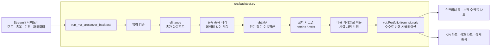

# 📈 QUANTMIND — 이동평균 교차 전략 백테스팅 & 스크리너

주식과 암호화폐의 과거 가격으로 **이동평균선 교차(골든크로스·데드크로스) 전략**을 검증하고, 여러 종목의 성과를 한 화면에서 비교하는 퀀트 투자 대시보드.

     

## 1. 개요

| 항목 | 내용 |
| --- | --- |
| 주제 | 이동평균선 교차 전략 백테스팅 및 다중 종목 스크리닝 |
| 목적 | 과거 데이터로 전략의 수익성과 위험을 검증하고, 종목별 성과를 비교해 순위를 매긴다 |
| 동기 | 데이터 수집 → 전략 계산 → 시뮬레이션 → 시각화로 이어지는 퀀트 투자 과정을 직접 구현 |
| 대상 | 미국 주식, 암호화폐, 국내 주식(KOSPI `.KS` / KOSDAQ `.KQ`) |

## 2. 주요 기능

**🔍 다중 종목 스크리너**
- 종목 그룹을 고르거나 티커를 쉼표로 구분해 입력한다.

  | 그룹 | 종목 |
  | --- | --- |
  | 🇺🇸 미국 빅테크 | AAPL, MSFT, GOOGL, AMZN, NVDA, TSLA, META |
  | 🪙 주요 암호화폐 | BTC-USD, ETH-USD, SOL-USD, DOGE-USD |
  | 🇰🇷 KOSPI IT/반도체 | 삼성전자, SK하이닉스, NAVER, 카카오 |

- 종목별 최근 시그널, 총 수익률, MDD, 샤프 지수, 승률, 거래 횟수를 표로 보여 주고 원하는 기준으로 정렬한다.
- 자산별 누적 수익률 비교 차트

**📊 단일 종목 상세 분석**
- 총 수익률, MDD, 샤프 지수, 승률 KPI 카드
- 누적 수익률, 낙폭, 매매 시점 차트와 전체 성과 지표 표

**⚙️ 파라미터:** 분석 기간(종료일 기본값은 오늘), 단기(2~100일)·장기(10~300일) 이동평균, 초기 자본, 수수료

## 3. 전략 로직

```
단기 이동평균(기본 10일)이 장기 이동평균(기본 50일)을
  아래에서 위로 돌파 (골든크로스) → 매수
  위에서 아래로 돌파 (데드크로스) → 매도 후 현금 보유
```

- 롱 온리 전략이며, 종목마다 초기 자본을 따로 배정한다(`cash_sharing=False`).
- 시그널은 당일 종가로 계산하고 **다음 거래일 종가**에 체결한다. 모든 거래에 수수료(기본 0.1%)를 반영한다.
- 최근 시그널(`get_latest_signal_info`)은 마지막 매수·매도 시그널 날짜를 비교해 판정한다.

  | 상태 | 조건 |
  | --- | --- |
  | 매수 보유 | 마지막 매수가 더 최근 |
  | 현금 관망 | 마지막 매도가 더 최근 |
  | 매수 진입 / 매도 청산 | 한쪽 시그널만 있음 |
  | 관망 | 시그널 없음 |

## 4. 아키텍처



**설계 포인트**
- **UI와 엔진 분리:** 계산은 `src/backtest.py`, 화면은 `app.py`가 맡아 엔진을 단독으로 실행·테스트할 수 있다.
- **입력 검증:** 티커, 이동평균 기간, 자본, 수수료, 날짜를 계산 전에 검사한다.
- **부분 실패 허용:** 데이터가 비어 있는 종목만 제외하고 분석을 이어간다.
- **단계별 예외 처리:** 다운로드, 전략 계산, 시뮬레이션 단계마다 오류를 구분해 기록한다.
- **벡터 연산:** vectorbt로 여러 종목을 한 번에 계산하고, 다단 컬럼은 티커 이름으로 정리한다.

## 5. 구조와 실행

```
QuantInvesting/
├── app.py            # Streamlit 대시보드
├── requirements.txt
└── src/
    └── backtest.py   # 백테스팅 엔진
```

```bash
pip install -r requirements.txt   # vectorbt 호환을 위해 plotly 5.x로 고정
streamlit run app.py              # 대시보드
python -m src.backtest            # 엔진 단독 실행 (AAPL, MSFT, TSLA 요약)
```

## 6. 트러블슈팅

### ① 최신 yfinance에서 단일 종목 분석 실패

- **문제:** 단일 종목 모드에서 `'DataFrame' object has no attribute 'to_frame'` 오류로 분석이 중단됐다.
- **원인:** yfinance 0.2.48부터 종목이 하나여도 `(Price, Ticker)` 2단 컬럼을 반환해, `df['Close']`가 Series가 아닌 DataFrame이 됐다.
- **해결:** DataFrame이면 첫 열을 티커 이름으로 바꾸고, Series면 기존처럼 변환한다. 버전은 `requirements.txt`에 명시했다.
  ```python
  close = df['Close']
  if isinstance(close, pd.DataFrame):
      close_df = close.iloc[:, [0]].copy()
      close_df.columns = [tickers[0]]
  else:
      close_df = close.to_frame(name=tickers[0])
  ```
- **검증:** 가짜 가격 데이터로 두 형식 모두 단일·다중 종목 분석이 동작함을 확인했다.

### ② 당일 종가 체결로 인한 look-ahead bias

- **문제:** 당일 종가로 교차를 계산하고 같은 종가에 체결하고 있었다.
- **원인:** 교차 여부는 장 마감 후에야 알 수 있어, 거래 시점에 없는 정보를 쓴 셈이었다.
- **해결:** 체결용 시그널을 하루 늦춰 다음 거래일 종가에 체결한다. 화면의 최근 시그널은 발생일 기준을 유지한다.
  ```python
  exec_entries = entries.shift(1, fill_value=False).astype(bool)
  exec_exits = exits.shift(1, fill_value=False).astype(bool)
  ```
- **검증:** 모든 주문이 같은 방향 시그널의 다음 거래일 종가로 체결됨을 주문 기록으로 확인했다.

### ③ 날짜 형식 오류 안내 누락

- **문제:** `2023/01/01`처럼 잘못 입력하면 한국어 안내 대신 영문 오류가 그대로 나왔다.
- **원인:** 오류 문구에 "strptime"이 포함됐는지로 형식 오류를 구분했는데, 실제 문구에는 그 단어가 없었다.
- **해결:** 날짜 파싱만 따로 `try`로 감싸고, 시작일·종료일 순서 검사는 분리했다.

## 7. 한계와 향후 계획

**한계**
- 이동평균 교차는 횡보장에서 잦은 매매로 손실이 쌓이기 쉽다.
- 기본 파라미터(10/50일)의 과거 성과만으로는 과최적화 위험이 있다.
- 수수료만 반영하고 슬리피지와 세금은 반영하지 않는다.

**향후 계획**
- [ ] Buy & Hold 대비 성과 비교
- [ ] 파라미터 조합별 성과 히트맵
- [ ] 결과 상태 유지: 정렬 기준을 바꾸면 결과가 초기화된다. `st.button`은 클릭 직후 한 번만 `True`라서, 결과를 `st.session_state`에 저장해 해결할 예정이다.
- [ ] `@st.cache_data`로 가격 데이터 캐싱
- [ ] 가짜 데이터 기반 엔진 테스트(pytest)
