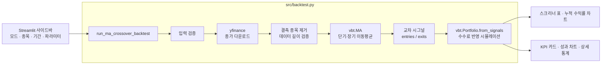

# 📈 QUANTMIND — 이동평균 교차 전략 백테스팅 & 스크리너

주식과 암호화폐의 과거 가격으로 **이동평균선 교차(골든크로스·데드크로스) 전략**을 검증하고, 여러 종목의 성과를 한 화면에서 비교하는 퀀트 투자 대시보드입니다.

     

<br/>

## 1. 프로젝트 개요

| 항목 | 내용 |
| --- | --- |
| 주제 | 이동평균선 교차 전략 백테스팅 및 다중 종목 스크리닝 |
| 목적 | 감이 아닌 과거 데이터로 매매 전략의 수익성과 위험을 검증하고, 종목별 성과를 비교해 순위를 매기는 것 |
| 동기 | 처음으로 퀀트 투자를 직접 구현해 본 프로젝트로, 데이터 수집 → 전략 계산 → 시뮬레이션 → 시각화 전 과정을 경험하기 위해 시작 |
| 대상 자산 | 미국 주식, 암호화폐, 국내 주식(KOSPI `.KS` / KOSDAQ `.KQ`) |

<br/>

## 2. 주요 기능

### 🔍 다중 종목 스크리너
- 미리 정의된 종목 그룹을 선택하거나, 티커를 쉼표로 구분해 직접 입력합니다.

  | 그룹 | 종목 |
  | --- | --- |
  | 🇺🇸 미국 빅테크 | AAPL, MSFT, GOOGL, AMZN, NVDA, TSLA, META |
  | 🪙 주요 암호화폐 | BTC-USD, ETH-USD, SOL-USD, DOGE-USD |
  | 🇰🇷 KOSPI IT/반도체 | 삼성전자, SK하이닉스, NAVER, 카카오 |

- 종목별 **최근 시그널, 총 수익률, 최대 낙폭(MDD), 샤프 지수, 승률, 거래 횟수**를 표로 보여줍니다.
- 매수 시그널과 수익은 초록색, 매도 시그널과 손실은 빨간색으로 강조합니다.
- 자산별 **누적 수익률 비교 차트**를 제공합니다.

### 📊 단일 종목 상세 분석
- 총 수익률, MDD, 샤프 지수, 승률을 **KPI 카드**로 보여줍니다. 값에 따라 색상이 달라집니다.
- 누적 수익률, 낙폭(Drawdown), 매매 시점을 한 번에 보여주는 차트를 제공합니다.
- vectorbt가 계산한 전체 성과 지표를 표로 펼쳐 볼 수 있습니다.

### ⚙️ 공통 파라미터
- 분석 기간 (시작일 · 종료일)
- 단기 이동평균 기간 (2~100일), 장기 이동평균 기간 (10~300일)
- 초기 자본, 거래 수수료(%)

<br/>

## 3. 전략 로직

```
단기 이동평균(기본 10일)이 장기 이동평균(기본 50일)을
  아래에서 위로 돌파 (골든크로스)  → 매수
  위에서 아래로 돌파 (데드크로스)  → 매도 후 현금 보유
```

- 롱 온리(Long-only) 전략이며, 종목마다 초기 자본을 따로 배정해 독립적으로 운용합니다 (`cash_sharing=False`).
- 모든 거래에 수수료(기본 0.1%)를 반영합니다.
- **최근 시그널 판정** (`get_latest_signal_info`)은 마지막 매수 시점과 마지막 매도 시점을 비교해 현재 상태를 알려줍니다.

  | 상태 | 조건 |
  | --- | --- |
  | 매수 보유 | 마지막 매수가 마지막 매도보다 최근 |
  | 현금 관망 | 마지막 매도가 마지막 매수보다 최근 |
  | 매수 진입 / 매도 청산 | 한쪽 시그널만 존재 |
  | 관망 | 시그널 없음 |

<br/>

## 4. 아키텍처



<br/>

## 5. 프로젝트 구조

```
QuantInvesting/
├── app.py            # Streamlit 대시보드 (UI, 두 가지 분석 모드, 차트)
├── requirements.txt  # 의존성 목록
└── src/
    ├── backtest.py   # 백테스팅 엔진 (데이터 수집, 전략 계산, 시뮬레이션)
    └── ai_task.md    # 구현 가이드 문서
```

<br/>

## 6. 실행 방법

```bash
# 의존성 설치 (vectorbt는 plotly 6과 호환되지 않아 plotly 5.x로 고정)
pip install -r requirements.txt

# 대시보드 실행
streamlit run app.py

# 엔진만 단독 실행 (AAPL, MSFT, TSLA 성과 요약 출력)
python -m src.backtest
```

<br/>

## 7. 코드 분석

### 👍 잘 설계된 부분

- **UI와 엔진 분리:** 계산 로직은 `src/backtest.py`에, 화면은 `app.py`에 두었습니다. 엔진은 대시보드 없이 단독으로 실행하고 테스트할 수 있습니다.
- **꼼꼼한 입력 검증:** 티커, 이동평균 기간(양수, 단기 < 장기), 자본, 수수료 범위, 날짜 순서를 계산 전에 검사합니다.
- **부분 실패 허용:** 여러 종목 중 일부 데이터가 비어 있으면 그 종목만 제외하고 나머지로 분석을 이어갑니다.
- **데이터 부족 방지:** 데이터 개수가 장기 이동평균 기간보다 적으면 명확한 오류 메시지로 중단합니다.
- **단계별 예외 처리와 로깅:** 다운로드, 전략 계산, 시뮬레이션 단계마다 오류를 따로 잡아 원인을 알 수 있게 했습니다.
- **벡터 연산:** vectorbt로 여러 종목을 반복문 없이 한 번에 계산합니다.
- **컬럼 정리:** vectorbt가 만드는 다단 컬럼을 티커 이름 한 단계로 정리해 화면 코드가 단순해졌습니다.

### 🔧 발견한 문제와 개선 과제

> 아래 1~3번은 합성 가격 데이터로 엔진을 실행해 직접 확인했습니다 (yfinance 1.7.0, vectorbt 1.1.0 기준).
> ✅ 표시한 항목은 수정을 완료했습니다.

**1. 최신 yfinance에서 단일 종목 분석이 실패합니다** `버그` ✅ 해결

yfinance 0.2.48부터는 종목이 하나여도 `(Price, Ticker)` 두 단계 컬럼으로 데이터를 돌려줍니다. 그래서 `df['Close']`가 Series가 아닌 DataFrame이 되고, `.to_frame()` 호출에서 오류가 납니다.

```
RuntimeError: 데이터 수집에 실패했습니다: 'DataFrame' object has no attribute 'to_frame'
```

`Close`가 DataFrame이면 첫 번째 열을 티커 이름으로 바꿔 쓰고, Series면 기존처럼 변환하도록 고쳤습니다. 예전 형식과 새 형식 모두에서 동작하는 것을 확인했습니다.

```python
close = df['Close']
if isinstance(close, pd.DataFrame):
    close_df = close.iloc[:, [0]].copy()
    close_df.columns = [tickers[0]]
else:
    close_df = close.to_frame(name=tickers[0])
```

**2. 시그널이 나온 날의 종가로 바로 체결됩니다** `백테스트 편향`

당일 종가로 이동평균과 교차 여부를 계산한 뒤, 같은 종가에 매수·매도한 것으로 처리합니다. 실제로는 장이 끝나야 시그널을 알 수 있으므로 수익률이 조금 낙관적으로 나올 수 있습니다. 시그널을 하루 늦추면 현실에 가까워집니다.

```python
entries = entries.shift(1, fill_value=False)
exits = exits.shift(1, fill_value=False)
```

**3. 날짜 형식 오류 메시지가 의도대로 나오지 않습니다** `사소함` ✅ 해결

`strptime`의 오류 문구에는 "strptime"이라는 단어가 없어서, 준비한 한국어 안내 대신 원래 영문 오류(`time data '...' does not match format`)가 그대로 나갔습니다. 날짜 파싱만 따로 `try`로 감싸 한국어 안내가 나오도록 고쳤습니다.

**4. 스크리너 정렬을 바꾸면 결과가 사라집니다** `UX`

Streamlit은 위젯 값이 바뀔 때마다 스크립트 전체를 다시 실행하는데, `st.button`은 누른 직후 한 번만 `True`입니다. 그래서 결과가 나온 뒤 정렬 기준을 바꾸면 결과 화면이 초기 화면으로 돌아갑니다. 결과를 `st.session_state`에 저장하거나, 정렬 선택을 버튼 누르기 전 사이드바로 옮기면 됩니다.

**5. 같은 조건을 반복 실행할 때마다 다시 다운로드합니다** `성능`

`@st.cache_data`로 가격 데이터 다운로드를 캐싱하면 파라미터만 바꿔 실행할 때 훨씬 빨라집니다.

**6. 저장소 정리** `유지보수` ✅ 일부 해결

- ✅ `requirements.txt`를 추가했습니다.
- ✅ 실행 결과물인 `__pycache__/`와 도구 세션 기록인 `.gjc/`를 저장소에서 제거하고 `.gitignore`에 추가했습니다.
- 자동화된 테스트가 아직 없습니다. yfinance 호출을 가짜 데이터로 바꿔 엔진을 검증하는 `pytest` 테스트를 추가하면 1번 같은 문제를 미리 잡을 수 있습니다.

### 📌 전략 자체의 한계

- 이동평균 교차는 추세가 뚜렷할 때 유리하고, 횡보장에서는 잦은 매매로 손실이 쌓이기 쉽습니다.
- 기본 파라미터(10/50일)로 과거 성과만 보면 **과최적화** 위험이 있습니다. 기간을 나눠 검증(Walk-forward)하거나 여러 파라미터 조합을 비교해 보는 것이 좋습니다.
- 수수료만 반영하고 **슬리피지**와 세금은 반영하지 않습니다.
- 비교 기준(Buy & Hold) 수익률이 함께 나오면 전략의 실제 가치를 판단하기 쉽습니다.

<br/>

## 8. 향후 계획

- [x] 단일 종목 yfinance 호환성 버그 수정
- [x] 날짜 형식 오류 안내 수정
- [ ] 시그널 다음 날 체결로 변경해 편향 제거
- [ ] Buy & Hold 대비 성과 비교
- [ ] 파라미터 조합 비교(히트맵) 기능
- [ ] 결과 상태 유지, 데이터 캐싱
- [x] `requirements.txt`, `.gitignore` 추가
- [ ] 엔진 테스트(pytest) 추가
