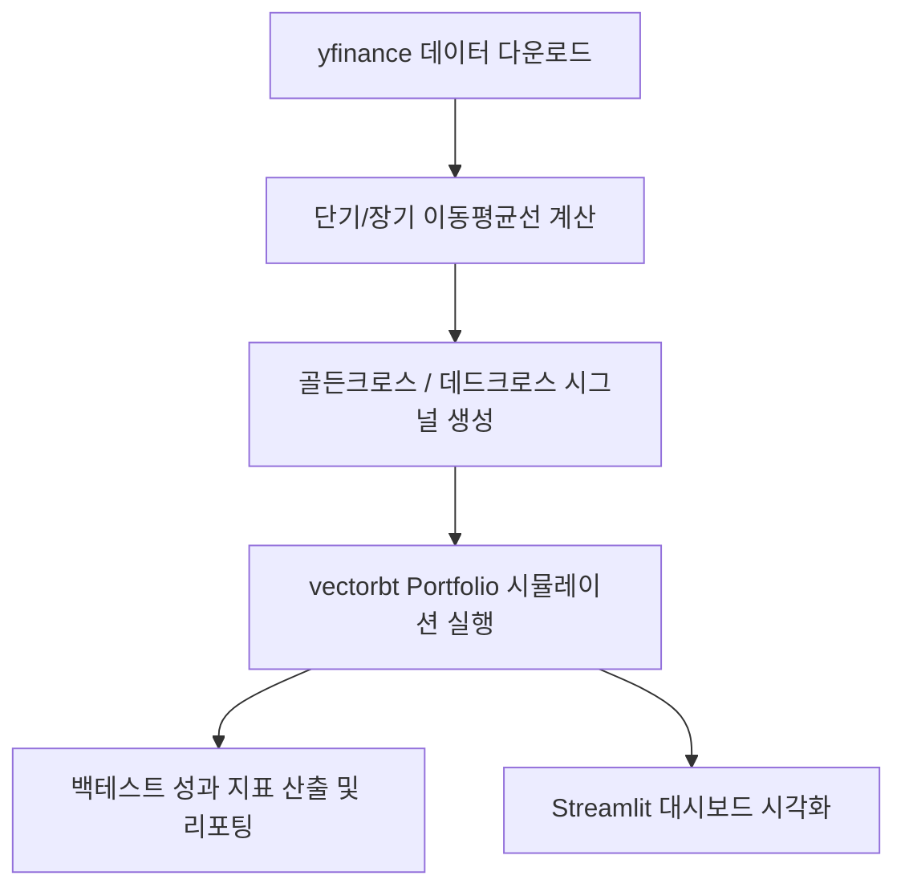

# 퀀트 투자 백테스팅 시스템 구현 가이드 (이동평균선 교차 전략)

본 가이드는 `yfinance`와 `vectorbt`를 사용하여 이동평균선 교차(Moving Average Crossover) 전략을 백테스팅하고, 결과를 시각화하기 위한 실제 구현 절차와 코드 템플릿을 제공합니다.

---

## 1. 개발 환경 및 종속성 설정

백테스팅 시스템을 구동하기 위해 필요한 라이브러리를 설치합니다. 프로젝트 루트의 가상환경(`.venv`)이 활성화된 상태에서 아래 명령어를 실행합니다.

```bash
pip install yfinance vectorbt pandas numpy matplotlib streamlit openpyxl
```

---

## 2. 시스템 아키텍처 및 구현 흐름



---

## 3. 핵심 코드 템플릿 (`src/backtest.py`)

아래 코드는 `vectorbt`를 이용한 백테스팅 코어 로직의 기본 템플릿입니다. 이 코드를 `src/backtest.py`로 생성하여 사용합니다.

```python
import numpy as np
import pandas as pd
import yfinance as yf
import vectorbt as vbt

def run_ma_crossover_backtest(
    ticker: str = "AAPL",
    start_date: str = "2020-01-01",
    end_date: str = "2026-01-01",
    fast_window: int = 10,
    slow_window: int = 50,
    init_cash: float = 10000.0,
    fees: float = 0.001  # 0.1% 수수료
):
    """
    이동평균선 교차 전략 백테스팅을 실행합니다.
    """
    print(f"[{ticker}] 데이터 다운로드 중 ({start_date} ~ {end_date})...")
    
    # 1. 데이터 다운로드
    data = yf.download(ticker, start=start_date, end=end_date)
    if data.empty:
        raise ValueError(f"데이터를 다운로드할 수 없습니다: {ticker}")
        
    close = data['Close']
    
    # 2. 이동평균선 계산
    fast_ma = vbt.MA.run(close, fast_window)
    slow_ma = vbt.MA.run(close, slow_window)
    
    # 3. 진입(매수) 및 청산(매도) 시그널 정의
    # 단기 MA가 장기 MA를 골든크로스할 때 매수
    entries = fast_ma.ma_crossed_above(slow_ma)
    # 단기 MA가 장기 MA를 데드크로스할 때 매도
    exits = fast_ma.ma_crossed_below(slow_ma)
    
    # 4. 포트폴리오 백테스팅 실행
    portfolio = vbt.Portfolio.from_signals(
        close=close,
        entries=entries,
        exits=exits,
        init_cash=init_cash,
        fees=fees,
        freq='D'
    )
    
    return portfolio, close, fast_ma.ma, slow_ma.ma

if __name__ == "__main__":
    # 기본 테스트 실행
    portfolio, close, fast, slow = run_ma_crossover_backtest(
        ticker="AAPL",
        start_date="2022-01-01",
        end_date="2026-01-01",
        fast_window=10,
        slow_window=50
    )
    
    # 성과 지표 출력
    print("\n=== 백테스트 성과 분석 지표 ===")
    print(portfolio.stats())
    
    # 결과 그래프 저장
    # fig = portfolio.plot()
    # fig.write_image("backtest_result.png") # plotly-orca 또는 kaleido 설치 필요
```

---

## 4. Streamlit 대시보드 연동 구현 (`app.py`)

Streamlit UI를 통해 사용자가 종목명(Ticker), 기간, 이동평균선 파라미터를 입력하고 실시간으로 차트와 지표를 확인할 수 있도록 구현합니다.

```python
import streamlit as st
import datetime
from src.backtest import run_ma_crossover_backtest

# 페이지 설정
st.set_page_config(page_title="퀀트 백테스팅 대시보드", layout="wide")
st.title("📈 이동평균선 교차 전략 백테스팅 대시보드")

# 사이드바 설정 영역
st.sidebar.header("설정 파라미터")
ticker = st.sidebar.text_input("종목 티커 (Yahoo Finance)", value="AAPL")

col1, col2 = st.sidebar.columns(2)
start_date = col1.date_input("시작일", datetime.date(2022, 1, 1))
end_date = col2.date_input("종료일", datetime.date(2026, 1, 1))

fast_window = st.sidebar.number_input("단기 이동평균선 기간 (Fast)", min_value=1, value=10)
slow_window = st.sidebar.number_input("장기 이동평균선 기간 (Slow)", min_value=1, value=50)

init_cash = st.sidebar.number_input("초기 자본금 ($)", min_value=100, value=10000)
fees = st.sidebar.slider("거래 수수료 (%)", min_value=0.0, max_value=1.0, value=0.1, step=0.01) / 100.0

if st.sidebar.button("백테스트 실행"):
    try:
        # 백테스트 실행
        portfolio, close, fast_ma, slow_ma = run_ma_crossover_backtest(
            ticker=ticker,
            start_date=start_date.strftime("%Y-%m-%d"),
            end_date=end_date.strftime("%Y-%m-%d"),
            fast_window=fast_window,
            slow_window=slow_window,
            init_cash=init_cash,
            fees=fees
        )
        
        # 1. 성과 요약 지표 출력
        st.subheader("📊 백테스트 주요 성과 지표")
        stats = portfolio.stats()
        
        # 주요 지표 UI 가시성 개선
        m_col1, m_col2, m_col3, m_col4 = st.columns(4)
        m_col1.metric("총 수익률 (Total Return)", f"{stats['Total Return [%]']:.2f}%")
        m_col2.metric("연환산 수익률 (CAGR)", f"{stats['Benchmark Return [%]']:.2f}% (Benchmark)")
        m_col3.metric("최대 낙폭 (Max Drawdown)", f"{stats['Max Drawdown [%]']:.2f}%")
        m_col4.metric("샤프 지수 (Sharpe Ratio)", f"{stats['Sharpe Ratio']:.3f}")
        
        # 전체 지표 테이블 표시
        with st.expander("전체 상세 성과 지표 보기"):
            st.dataframe(stats, use_container_width=True)
            
        # 2. 시각화 차트 출력
        st.subheader("📈 포트폴리오 자산 변화 및 매매 시그널")
        fig = portfolio.plot(subplots=['drawdowns', 'cum_returns', 'trade_signals'])
        st.plotly_chart(fig, use_container_width=True)
        
    except Exception as e:
        st.error(f"백테스팅 중 오류가 발생했습니다: {e}")
```

---

## 5. 핵심 평가 지표 가이드

성과 요약 시 다음 4가지 핵심 지표를 확인하여 전략을 검증합니다:

1. **Total Return [%] (총 수익률)**: 백테스팅 기간 동안의 누적 수익률. Benchmark Return(단순 보유 전략) 대비 초과 수익을 달성했는지 평가합니다.
2. **Max Drawdown [%] (최대 낙폭, MDD)**: 포트폴리오의 고점 대비 최대 하락 비율로, 전략의 위험 한도를 직접적으로 보여줍니다. (보통 -20% 이내 유지를 지향)
3. **Sharpe Ratio (샤프 지수)**: 위험(변동성) 대비 초과 수익률. 일반적으로 1.0 이상이면 우수, 2.0 이상이면 매우 훌륭한 전략으로 간주됩니다.
4. **Win Rate [%] (승률)**: 총 거래 중 익절로 끝난 거래의 비율.

---

## 6. 검증 및 확장 로직 추가 제안

- **다중 종목 백테스팅**: `yf.download(["AAPL", "MSFT", "GOOGL"])` 형식으로 여러 종목의 컬럼 데이터를 입력하여 포트폴리오 다변화 효과를 시뮬레이션할 수 있습니다.
- **파라미터 최적화(Grid Search)**: `vectorbt`는 단 몇 줄의 코드로 단기/장기 이동평균 창 조합 전체에 대해 루프 없이 한 번에 연산하여 최적의 파라미터를 찾는 최적화 기능을 기본 지원합니다.
  ```python
  # 예시: 복수 파라미터 조합 동시 계산
  fast_windows = np.arange(10, 50, 10)
  slow_windows = np.arange(50, 150, 10)
  portfolio = vbt.Portfolio.from_signals(
      close, 
      entries=vbt.MA.run(close, fast_windows).ma_crossed_above(vbt.MA.run(close, slow_windows)),
      ...
  )
  ```
